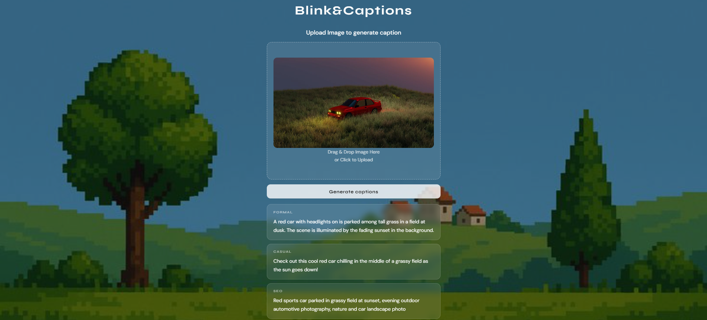

# 🖼️ Blink&Captions — AI Image Caption Generator

Generate multiple styles of captions from any image using AI.

Upload an image and instantly receive AI-generated captions tailored for different purposes, including professional descriptions, casual social media content, SEO-friendly keywords, and accessibility-focused alt text.

> 📸 Project Screenshot

<!-- Replace with your screenshot -->



---

## ✨ Features

- Upload any image and generate captions instantly
- Four distinct caption styles:
  - 📄 Formal
  - 😊 Casual
  - 🔍 SEO Optimized
  - ♿ Alt Text (WCAG-friendly)
- Modern and responsive UI
- Drag-and-drop image upload
- Powered by OpenAI GPT-4.1 Vision
- Useful for content creators, marketers, bloggers, and accessibility workflows

---

## 🚀 How It Works

1. Upload an image
2. AI analyzes the image using OpenAI GPT-4.1 Vision
3. Four unique caption styles are generated:
   - Formal
   - Casual
   - SEO
   - Alt Text

---

## 🛠️ Tech Stack

- Python
- Flask
- HTML5
- CSS3
- JavaScript
- OpenAI GPT-4.1 Vision API

---

## 📂 Project Structure

```text
Blink&Captions/
│
├── static/
│   ├── css/
│   └── images/
│
├── templates/
│   └── index.html
│
├── main.py
├── requirements.txt
├── .gitignore
└── README.md
```
---

## 🔑 Environment Variables

Create a `.env` file in the project root:

```env
OPENAI_API_KEY=your_openai_api_key
```

---

## ▶️ Run Locally

```bash
python main.py
```

Then open:

```text
http://127.0.0.1:5000
```

---

## 📦 Requirements

```txt
flask
openai
python-dotenv
```

---

## 🔮 Future Improvements

- Social media platform-specific captions
- Hashtag generation
- Multi-language caption support
- Custom caption tones
- Caption history
- User authentication

---

## 🌐 Try It Out

🌍 **App:** Add your deployed application link here

---

## 👨‍💻 Author

**Deepanshu Tevathiya** — AI / ML Enthusiast

[]([YOUR_LINKEDIN_URL](https://www.linkedin.com/in/deepanshu-tevathiya/))
[]([YOUR_GITHUB_URL](https://github.com/DeepanshuTevathiya))

---

⭐ If you found this project useful, consider giving it a star.
